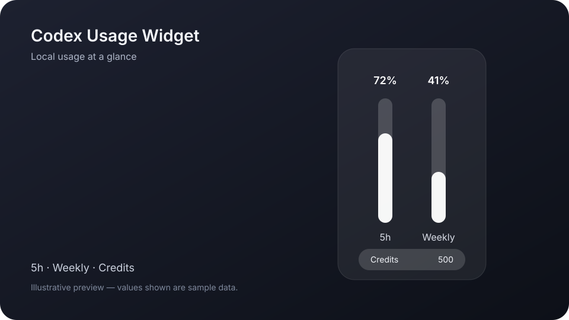

<p align="center">
  
</p>

<h1 align="center">Codex Usage Widget</h1>

<p align="center">A lightweight native macOS menu bar app and floating widget for monitoring Codex usage limits and credits locally.</p>

## Product preview



The preview uses fictional mock values and contains no account or usage data. The hourglass app icon and preview artwork were created for this project; asset details are documented in [Assets/README.md](Assets/README.md).

## Features

- Shows the remaining 5-hour and weekly Codex usage limits.
- Shows the available Credits balance when the local Codex service provides it.
- Provides a compact, draggable, always-on-top desktop panel.
- Includes a menu bar summary with refresh, show/hide, and quit actions.
- Refreshes on local Codex events, every 60 seconds, after wake, and on demand.
- Reconfirms the active account after account changes, wake, app activation, and manual refresh.
- Keeps the last successful reading after ordinary transient refresh failures.
- Rejects delayed responses and events from retired local app-server sessions.

## Requirements

- macOS 13 Ventura or later.
- Swift 6 when building from source.
- Codex installed locally, either through the Codex CLI or a compatible ChatGPT app installation.
- A signed-in Codex/ChatGPT account.

The source builds for the architecture of the host Mac. The current V1 packaging script creates a single-architecture app for that host; it does not create a universal binary. Apple Silicon is verified locally. Intel source builds are expected to work but are not yet CI-verified.

Windows and Linux are not supported because the app uses AppKit and SwiftUI.

## Installation

Prebuilt, signed release downloads are planned for GitHub Releases. V1 currently supports building locally from source.

## Build from Source

```bash
git clone https://github.com/lylinnnnnn/codex-usage-widget.git
cd codex-usage-widget
swift build
swift test
./Scripts/build-app.sh
open build/CodexUsageWidget.app
```

The app bundle produced by the script is ad-hoc signed. Developer ID signing and notarization are intentionally outside the V1 scope.

## Usage

Launch the app while Codex is installed and signed in. Drag the floating widget to reposition it. Use the menu bar icon to refresh, hide or show the widget, or quit.

For local UI development without reading an account, run:

```bash
swift run CodexUsageWidget --mock-usage
```

Set `CODEX_USAGE_WIDGET_CODEX_PATH` to an explicit executable path only when the automatic Codex lookup does not find your installation.

## Credits

Credits are shown as their raw balance by default. This avoids presenting a currency conversion as an official OpenAI price.

On first use, the app creates this local configuration file:

```text
~/Library/Application Support/CodexUsageWidget/credit-display.json
```

To opt in to an estimated USD display, set `displayMode` to `estimatedUSD` and choose your own `usdPerCredit` value. The bundled `0.04` value is only a user-configurable project assumption. It is not an official or permanent OpenAI price. Estimated values are marked `est.` in the UI.

## Privacy

- The app communicates with the locally installed `codex app-server` over standard input/output.
- It requests `account/read` with token refresh disabled and `account/rateLimits/read`.
- It does not read `~/.codex/auth.json`.
- It does not read browser cookies or browser login data.
- It does not ask for, store, or upload API keys, passwords, or authentication tokens.
- It does not collect or upload account or usage data.
- Account information is processed only in memory on the local Mac. A one-way account fingerprint is used only to keep account and usage snapshots correctly associated; the email itself is not displayed or persisted by this app.
- Window position and the optional Credits display preference are stored locally.

The locally installed Codex service remains responsible for its own authenticated communication with OpenAI.

## Known Limitations

- macOS only; minimum version is macOS 13.
- The V1 build script creates an app for the current Mac architecture, not a universal binary.
- Developer ID signing, notarization, automatic updates, and automated releases are not included yet.
- Availability and shape of the local app-server response may change between Codex versions.
- Credits currency estimates depend entirely on the user's local assumption.

## Contributing

Issues and focused pull requests are welcome. Please run both commands before submitting a change:

```bash
swift build
swift test
```

Do not include credentials, account data, local logs, built apps, or machine-specific paths in issues or commits.

## License

MIT. See [LICENSE](LICENSE).

## Disclaimer

Unofficial project. Not affiliated with or endorsed by OpenAI.

Codex, ChatGPT, OpenAI, and related names and marks belong to their respective owners.
