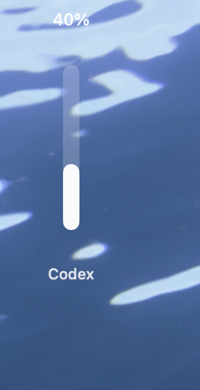
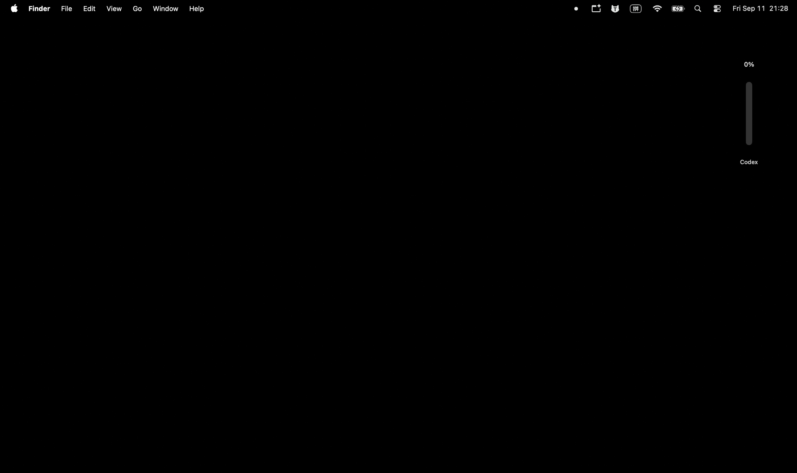
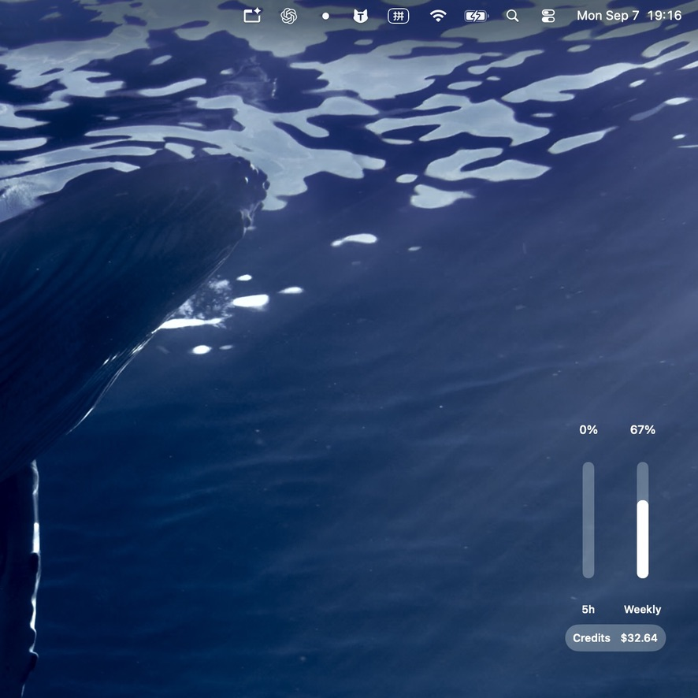
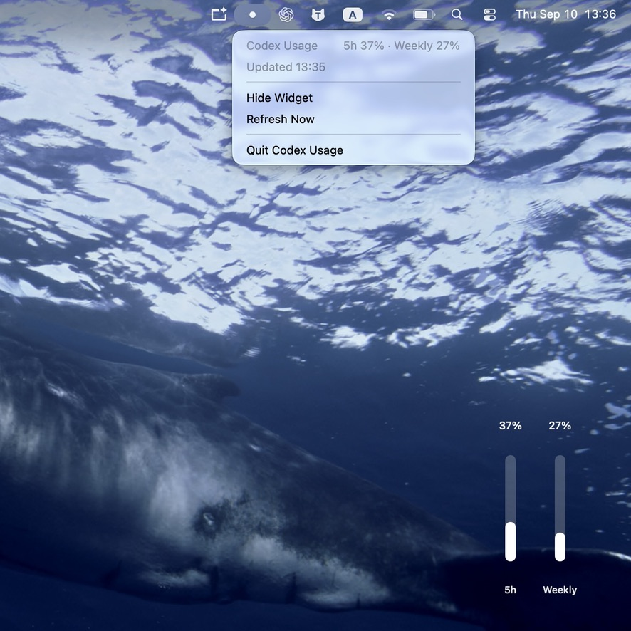

<p align="center">
  
</p>

<h1 align="center">Codex Usage Widget</h1>

<p align="center">Two native macOS desktop widgets that keep your Codex usage limits—and Credits when available—visible at a glance.</p>

<p align="center">This repository includes two standalone macOS apps for keeping Codex usage visible on your desktop.</p>

<p align="center">The two apps present data from the same local Codex service in different desktop forms: a single Codex bar or an adaptive Capsule view.</p>

<p align="center">
  <a href="#two-apps-one-repository">Two apps</a> ·
  <a href="#installation">Installation</a> ·
  <a href="#privacy">Privacy</a> ·
  <a href="#build-from-source">Build from source</a>
</p>

## Two apps, one repository

This repository contains two standalone macOS apps—not two interface modes of one app. Each has its own executable, app bundle, bundle identifier, desktop position, menu-bar controls, and local configuration. Build, launch, and use either app independently, or run both side by side. When GitHub Releases are available, each app will have its own download.

| App | What it does |
| --- | --- |
| `CodexUsageWidget` | A compact, single-bar desktop app. It keeps the current Codex usage visible as one vertical `Codex` bar. |
| `CodexUsageCapsuleWidget` | A separate adaptive Capsule-style desktop app with its own UI implementation, refresh cycle, menu-bar controls, desktop position, and Credits pricing preference. It presents rate-limit windows, Monthly usage, and Credits when available from the local Codex service. |

<table>
  <tr>
    <td align="center" width="50%">
      <strong>CodexUsageWidget</strong><br>
      <sub>Single Codex usage bar</sub><br><br>
      
    </td>
    <td align="center" width="50%">
      <strong>CodexUsageCapsuleWidget</strong><br>
      <sub>Adaptive rate-limit, Monthly, and Credits capsules</sub><br><br>
      
    </td>
  </tr>
</table>

## Capsule usage at a glance


A real macOS desktop showing the `CodexUsageCapsuleWidget` 5-hour and weekly rate-limit capsules.

## Capsule data adapts to what is available

| Available data | Capsule display |
| --- | --- |
| 5-hour and weekly limits | Two usage capsules |
| 5-hour and weekly limits, plus Credits | Two usage capsules plus a Credits capsule |
| Monthly limit | A Monthly capsule, plus Credits when available |

`CodexUsageCapsuleWidget` displays only the usage windows reported by your local Codex service, and shows Credits only when that service makes a balance available. `CodexUsageWidget` keeps the current reading in one vertical `Codex` bar.

## Menu Bar Controls

`CodexUsageWidget` has its own menu-bar controls to refresh on demand, show or hide its single desktop bar, and quit. `CodexUsageCapsuleWidget` provides a separate set of controls.


## Highlights

- **Two standalone apps** — Build, package, launch, and run the two apps independently.
- **Single Codex bar** — `CodexUsageWidget` keeps the current reading visible in one compact, draggable, always-on-top bar.
- **Adaptive Capsule view** — `CodexUsageCapsuleWidget` presents the available rate-limit windows, Monthly usage, and Credits capsules.
- **Native macOS experience** — Use the desktop widget together with a lightweight menu bar summary and controls.
- **Local-first privacy** — No credential scraping, browser-cookie access, telemetry, or account-data uploads.
- **Reliable refreshes** — Updates on local Codex events, every 60 seconds, after wake, and on demand.
- **Consistent account state** — Keeps the last successful reading through temporary failures and prevents stale session data from replacing current usage.

## On your desktop

### CodexUsageWidget

A real macOS desktop state with the single `Codex` usage bar in place.

<p align="center">
  
</p>

### CodexUsageCapsuleWidget

Real desktop views of the adaptive Capsule app.

<p align="center">
  
  
  
</p>

## Installation

A downloadable GitHub Release is not available yet. Until then, build either standalone app from source.

## Requirements

- macOS 13 Ventura or later.
- Apple Silicon (arm64) for the current packaged builds.
- Swift 6 when building from source.
- Codex installed locally, either through the Codex CLI or a compatible ChatGPT app installation.
- A signed-in Codex/ChatGPT account.

The current packaging script produces Apple Silicon (arm64) apps only. Intel and universal packaged builds are not provided.

Windows and Linux are not supported because the app uses AppKit and SwiftUI.

## Everyday use

Launch either app while Codex is installed and signed in. Drag its floating widget to reposition it. Use its menu bar icon to refresh, hide or show the widget, or quit. The two apps can run at the same time.

## Credits

Credits are optional. `CodexUsageCapsuleWidget` shows a Credits capsule only when the local Codex service provides a balance.

`CodexUsageCapsuleWidget` uses its own local Credits pricing preference:

```text
~/Library/Application Support/CodexUsageCapsuleWidget/credit-pricing.json
```

Its USD display uses the user-configurable `usdPerCredit` assumption in that file. The bundled `0.04` value is a project assumption, not an official or permanent OpenAI price.

## Privacy

- Both apps communicate with the locally installed `codex app-server` over standard input/output.
- `CodexUsageWidget` requests account state with token refresh disabled; both apps read the available rate-limit data from that local service.
- Neither app reads `~/.codex/auth.json`, browser cookies, or browser login data.
- Neither app asks for, stores, or uploads API keys, passwords, or authentication tokens.
- Neither app collects or uploads account or usage data.
- Account information stays in memory on the local Mac. `CodexUsageWidget` uses a one-way account fingerprint only to keep current usage correctly associated; account identifiers are not displayed or persisted.
- Each app stores its own window position. `CodexUsageCapsuleWidget` also stores its optional local Credits preference.

The locally installed Codex service remains responsible for its own authenticated communication with OpenAI.

## Known Limitations

- macOS only; minimum version is macOS 13.
- Current packaged builds are Apple Silicon (arm64) only; Intel and universal packaged builds are not provided.
- The packaged apps are ad-hoc signed and not notarized. Developer ID signing, automatic updates, and automated releases are not included yet.
- Availability and shape of the local app-server response may change between Codex versions.
- Credits currency estimates depend entirely on the user's local assumption.

## Build from Source

```bash
git clone https://github.com/lylinnnnnn/codex-usage-widget.git
cd codex-usage-widget

# Optional: run the project test suite.
swift test
```

### CodexUsageWidget

```bash
swift build --product CodexUsageWidget
./Scripts/build-app.sh CodexUsageWidget
open build/CodexUsageWidget.app
```

### CodexUsageCapsuleWidget

```bash
swift build --product CodexUsageCapsuleWidget
./Scripts/build-app.sh CodexUsageCapsuleWidget
open build/CodexUsageCapsuleWidget.app
```

Each packaging command produces a separate arm64 `.app` and ZIP in `build/`. Both bundles are ad-hoc signed and not notarized. Intel packages and universal binaries are not currently provided, and a downloadable GitHub Release is not available yet.

For local UI development of `CodexUsageWidget` without reading an account, run:

```bash
swift run CodexUsageWidget --mock-usage
```

Set `CODEX_USAGE_WIDGET_CODEX_PATH` for `CodexUsageWidget`, or `CODEX_CAPSULE_WIDGET_CODEX_PATH` for `CodexUsageCapsuleWidget`, to an explicit executable path only when automatic Codex lookup does not find your installation.

## Contributing

Issues and focused pull requests are welcome. Please build both apps and run the test suite before submitting a change:

```bash
swift build --product CodexUsageWidget
swift build --product CodexUsageCapsuleWidget
swift test
```

Do not include credentials, account data, local logs, built apps, or machine-specific paths in issues or commits.

## License

MIT. See [LICENSE](LICENSE).

## Disclaimer

Unofficial project. Not affiliated with or endorsed by OpenAI.

Codex, ChatGPT, OpenAI, and related names and marks belong to their respective owners.
