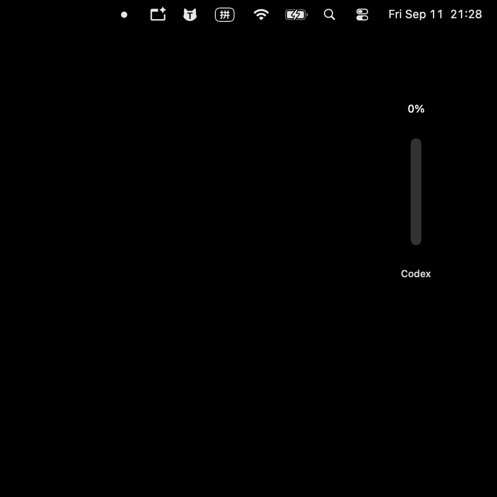
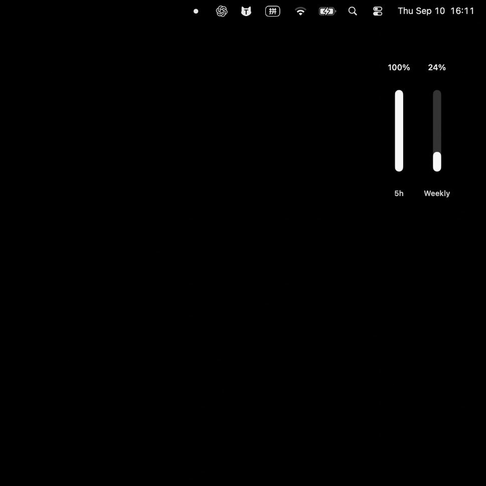
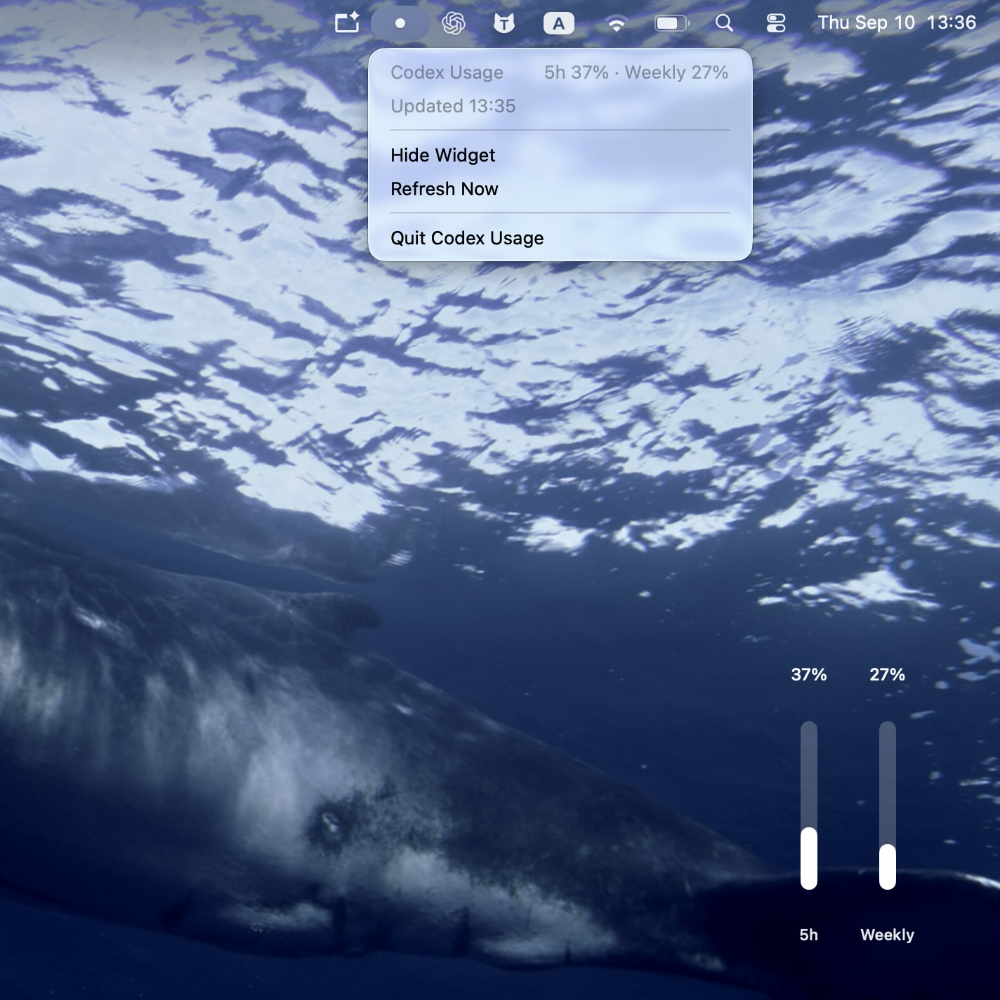
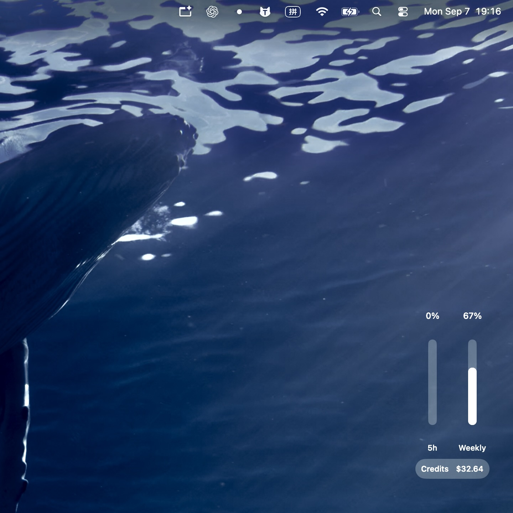
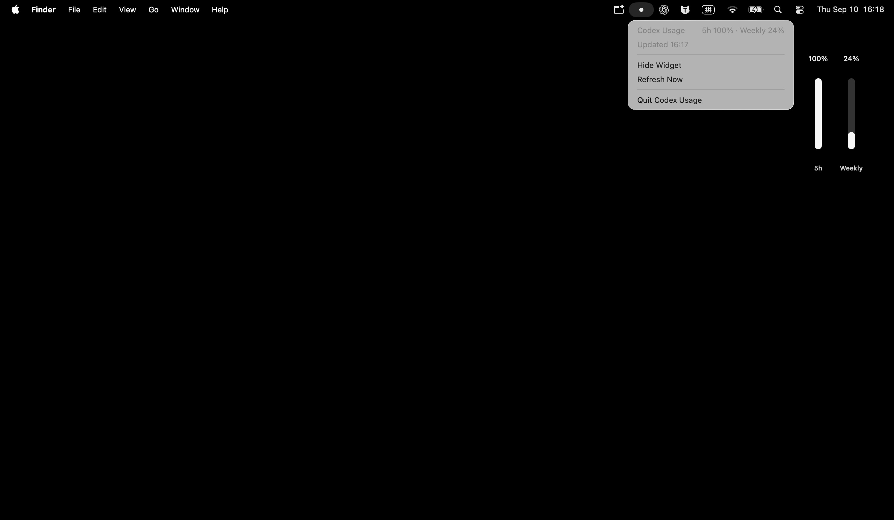

<div align="center">

# Codex Usage Widgets

**ONE REPOSITORY · TWO MACOS APPS**

Two native macOS apps for keeping Codex usage visible on your desktop.

One stays intentionally minimal. The other shows the usage windows and Credits data returned by your local Codex service.

</div>

---

## APP 01

# Simple App

A minimal desktop widget with one vertical usage bar, a percentage above it, and “Codex” underneath.

<table>
<tr>
<td width="56%" align="center">

</td>
<td width="44%" valign="top">

### The quiet version.

Designed for people who only want the essential Codex usage number visible at a glance.

- Single vertical usage bar
- Percentage above the bar
- “Codex” label below
- Minimal visual footprint

</td>
</tr>
</table>

---

## APP 02

# Detailed App

A more complete Codex usage widget that adapts to the usage windows and Credits data returned by your local Codex service.

<table>
<tr>
<td width="56%" align="center">

</td>
<td width="44%" valign="top">

### More detail when you need it.

The detailed app changes its layout based on the usage data that is actually available.

- 5-hour and weekly usage when available
- Monthly usage when returned by the account
- Credits appears only when available
- Menu bar controls for refresh, show/hide, and quit

</td>
</tr>
</table>

---

## DETAILED APP · THREE STATES

# Adaptive display states

<table>
<tr>
<td width="33%" align="center">

### 5-hour + Weekly



Two usage indicators when both usage windows are available.

</td>
<td width="33%" align="center">

### 5-hour + Weekly + Credits



Credits appears only when a balance is available.

</td>
<td width="33%" align="center">

### Monthly


Monthly usage display, with Credits when available.

</td>
</tr>
</table>

---

## MENU BAR

# Controls stay close by

<p align="center">

</p>

---

## HIGHLIGHTS

# Native, lightweight, and local-first

<table>
<tr>
<td width="33%"><strong>Desktop-first</strong><br>Keep Codex usage visible without opening a browser page.</td>
<td width="33%"><strong>Adaptive data</strong><br>The detailed app shows only the usage data actually returned by the local service.</td>
<td width="33%"><strong>Menu bar controls</strong><br>Refresh, show or hide the widget, and quit from the menu bar.</td>
</tr>
<tr>
<td><strong>Local-first privacy</strong><br>No browser-cookie access, credential scraping, telemetry, or account-data uploads by the app.</td>
<td><strong>Reliable refreshes</strong><br>Updates on local Codex events, every 60 seconds, after wake, and on demand.</td>
<td><strong>Native macOS</strong><br>Built with SwiftUI and AppKit.</td>
</tr>
</table>

---

## INSTALLATION

# Build locally from source

<table>
<tr>
<td width="50%" valign="top">

### Requirements

- macOS 13 Ventura or later
- Apple Silicon (arm64) for the current packaged builds
- Swift 6 when building from source
- Codex installed locally
- A signed-in Codex / ChatGPT account

</td>
<td width="50%" valign="top">

### Everyday use

Launch either app while Codex is installed and signed in.

Reposition the widget on the desktop and use the menu bar controls when needed.

The two apps can run independently or side by side.

</td>
</tr>
</table>

---

## BUILD FROM SOURCE

# Local build

```bash
git clone https://github.com/lylinnnnnn/codex-usage-widget.git
cd codex-usage-widget
swift test
```

### Simple App · CodexUsageWidget

```bash
swift build --product CodexUsageWidget
./Scripts/build-app.sh CodexUsageWidget
open build/CodexUsageWidget.app
```

### Detailed App · CodexUsageCapsuleWidget

```bash
swift build --product CodexUsageCapsuleWidget
./Scripts/build-app.sh CodexUsageCapsuleWidget
open build/CodexUsageCapsuleWidget.app
```

---

## LICENSE & DISCLAIMER

# Project information

**License:** MIT. See [LICENSE](LICENSE).

**Disclaimer:** Unofficial project. Not affiliated with or endorsed by OpenAI.

Codex, ChatGPT, OpenAI, and related names and marks belong to their respective owners.
