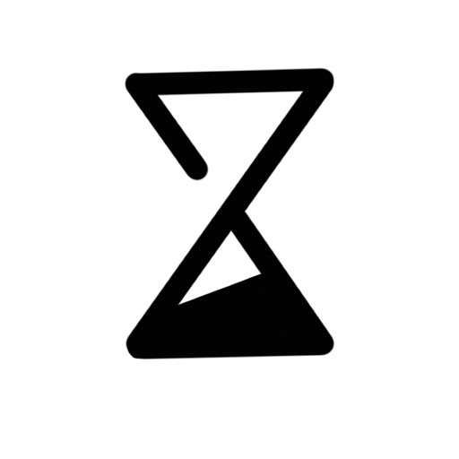

<div align="center">

<p>
&nbsp;&nbsp;&nbsp;&nbsp;&nbsp;&nbsp;

</p>

# Codex Usage Widgets

**ONE REPOSITORY · TWO macOS APPS**

**English** | [简体中文](README.zh-CN.md)

Two native macOS apps for keeping Codex usage visible on your desktop.

One stays intentionally minimal. The other shows the usage windows and Credits data returned by your local Codex service.

</div>

---

## APP 01

# Simple App

A minimal desktop widget with one vertical usage bar, a percentage above it, and “Codex” underneath.

<table>
<tr>
<td width="56%" align="center">

</td>
<td width="44%" valign="top">

### The quiet version.

Designed for people who only want the essential Codex usage number visible at a glance.

- Single vertical usage bar
- Percentage above the bar
- “Codex” label below
- Minimal visual footprint

</td>
</tr>
</table>

---

## APP 02

# Detailed App

A more complete Codex usage widget with two display modes: adaptive desktop Capsules and lightweight menu-bar Notch Compact.

<table>
<tr>
<td width="56%" align="center">

</td>
<td width="44%" valign="top">

### More detail when you need it.

In Capsules mode, the detailed app changes its layout based on the usage data that is actually available.

- 5-hour and weekly usage when available
- Monthly usage when returned by the account
- Credits appears only when available
- Menu bar controls for display-mode switching, usage details, Refresh Now, show/hide in Capsules mode, and quit

</td>
</tr>
</table>

---

## DISPLAY MODES

# Two ways to keep usage visible

`CodexUsageCapsuleWidget` has two mutually exclusive display modes. Choose one from the menu bar; the selection is preserved after the app restarts.

<table>
<tr>
<td width="50%" valign="top">

### Capsules

The original adaptive floating-capsule display adapts to the available data, including 5-hour and weekly usage, with monthly usage and Credits when available.

</td>
<td width="50%" valign="top">

### Notch Compact

New in v0.2.0, a lightweight standard macOS menu-bar mode. Its compact Micro Pill shows `5h 25% · W 88%`, reveals the last update time on hover, and lets you access the existing usage details and Refresh action when clicked.


</td>
</tr>
</table>

---

## DETAILED APP · THREE STATES

# Adaptive data states in Capsules

These are adaptive data states in Capsules, not additional display modes.

<table>
<tr>
<td width="33%" align="center">

### 5-hour + Weekly


Two usage indicators when both usage windows are available.

</td>
<td width="33%" align="center">

### 5-hour + Weekly + Credits


Credits appears only when a balance is available.

</td>
<td width="33%" align="center">

### Monthly+ Credits


Monthly usage display, with Credits when available.

</td>
</tr>
</table>

---

## MENU BAR

# Controls stay close by

Switch between Capsules and Notch Compact, see usage details, refresh, show or hide the Capsules widget when applicable, or quit.

<p align="center">

</p>

---

## HIGHLIGHTS

# Native, lightweight, and local-first

<table>
<tr>
<td width="33%"><strong>Desktop-first</strong><br>Keep Codex usage visible without opening a browser page.</td>
<td width="33%"><strong>Adaptive data</strong><br>The detailed app shows only the usage data actually returned by the local service.</td>
<td width="33%"><strong>Menu bar controls</strong><br>Switch display modes, refresh, show or hide Capsules when applicable, and quit from the menu bar.</td>
</tr>
<tr>
<td><strong>Local-first privacy</strong><br>No browser-cookie access, credential scraping, telemetry, or account-data uploads by the app.</td>
<td><strong>Reliable refreshes</strong><br>Updates on local Codex events, every 60 seconds, after wake, and on demand.</td>
<td><strong>Native macOS</strong><br>Built with SwiftUI and AppKit.</td>
</tr>
</table>

---

## INSTALLATION

# Download a release

Prebuilt ZIPs are available from [GitHub Releases](https://github.com/lylinnnnnn/codex-usage-widget/releases). Choose the app that fits how much detail you want:

- **CodexUsageWidget** — the minimal single-bar widget
- **CodexUsageCapsuleWidget** — the adaptive detailed widget with Capsules and Notch Compact display modes

The current v0.2.0 packages are Apple Silicon (arm64) builds for macOS 13 Ventura or later. Download the corresponding ZIP, unzip it to get the matching `.app`, then move it to `/Applications` if you like.

v0.2.0 uses ad-hoc signing and is not yet Apple notarized, so macOS may ask for confirmation the first time you open it. In Finder, right-click the app and choose **Open**, or allow it in **System Settings → Privacy & Security**.

<table>
<tr>
<td width="50%" valign="top">

### Requirements

- macOS 13 Ventura or later
- Apple Silicon (arm64) for the current packaged builds
- Swift 6 when building from source
- Codex installed locally
- A signed-in Codex / ChatGPT account

</td>
<td width="50%" valign="top">

### Everyday use

Launch either app while Codex is installed and signed in.

Reposition the widget on the desktop and use the menu bar controls when needed.

The two apps can run independently or side by side.

</td>
</tr>
</table>

---

## BUILD FROM SOURCE

# Local build

```bash
git clone https://github.com/lylinnnnnn/codex-usage-widget.git
cd codex-usage-widget
swift test
```

### Simple App · CodexUsageWidget

```bash
swift build --product CodexUsageWidget
./Scripts/build-app.sh CodexUsageWidget
open build/CodexUsageWidget.app
```

### Detailed App · CodexUsageCapsuleWidget

```bash
swift build --product CodexUsageCapsuleWidget
./Scripts/build-app.sh CodexUsageCapsuleWidget
open build/CodexUsageCapsuleWidget.app
```

---

## LICENSE & DISCLAIMER

# Project information

**License:** MIT. See [LICENSE](LICENSE).

**Disclaimer:** Unofficial project. Not affiliated with or endorsed by OpenAI.

Codex, ChatGPT, OpenAI, and related names and marks belong to their respective owners.

---

<p align="center">
© 2026 lylinnnnnn. All rights reserved.<br>
Logo and app icons are not licensed for reuse or redistribution.
</p>
